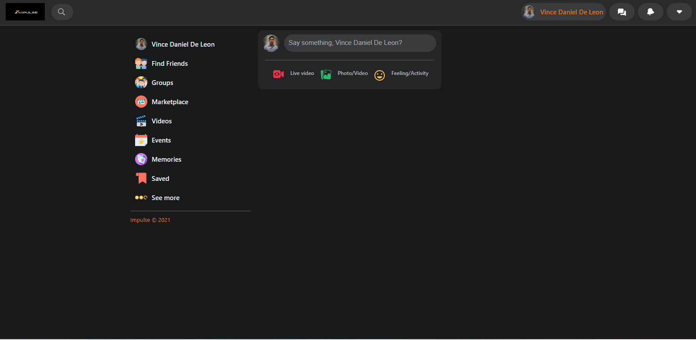
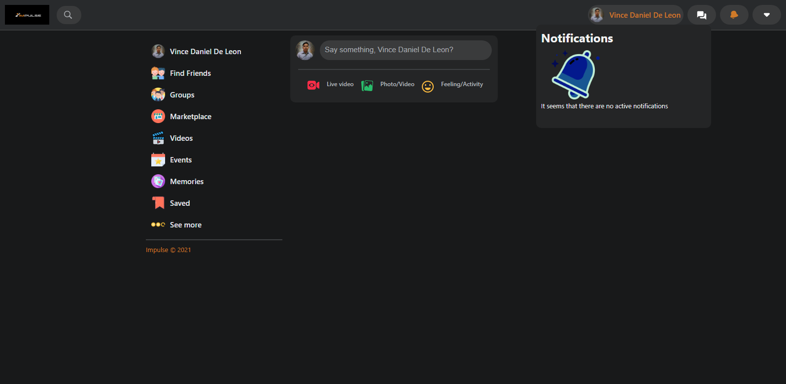
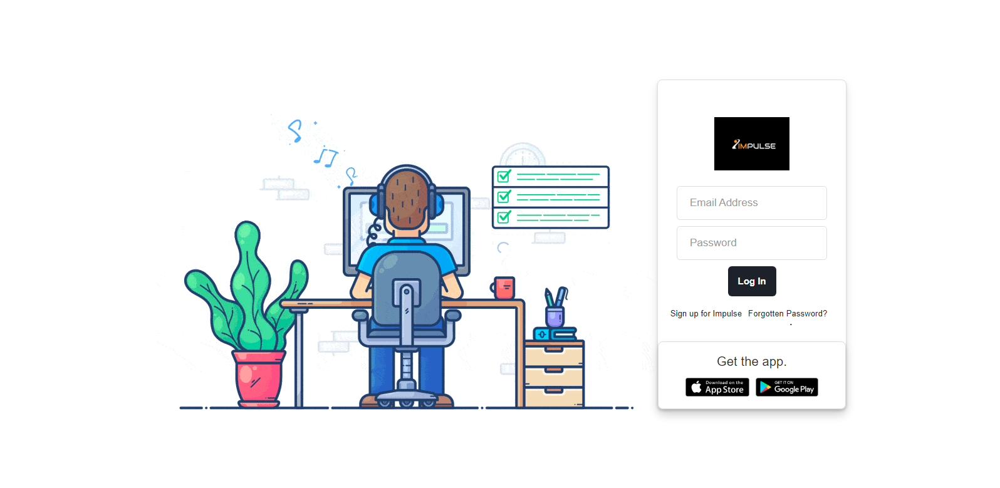
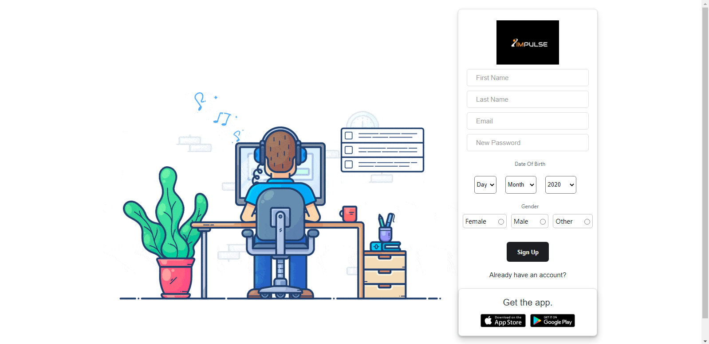
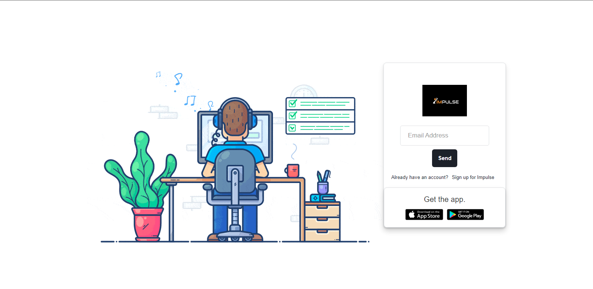

# Impulse Social Media - React & PWA Builder

[Website Link](https://impulsesocialmedia.netlify.app)

## Features
- Responsive UI
- Login, Register, Forgot Password
- Post images with caption
- Comment 
- Notifications when someone comments
- Profile see your all post
- You can search other user
- Data Base Firebase
